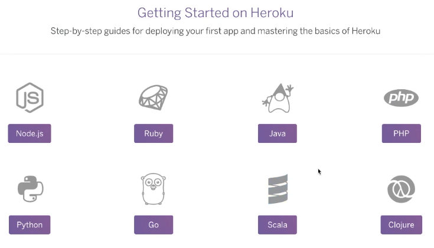

# React MySQL Deployment on Heroku

1. Go to [heroku.com](https://www.heroku.com/)
    - Sign Up
        - Fill out the form
        - Sign up for the free account
        - Proceed with E-mail verification
2. Log In to [heroku.com](https://www.heroku.com/)
3. Download `heroku cli` at [Heroku Dev Center](https://devcenter.heroku.com/start)
    - Select Node JS
      
    - Click on large purple button **I'm ready to start**
