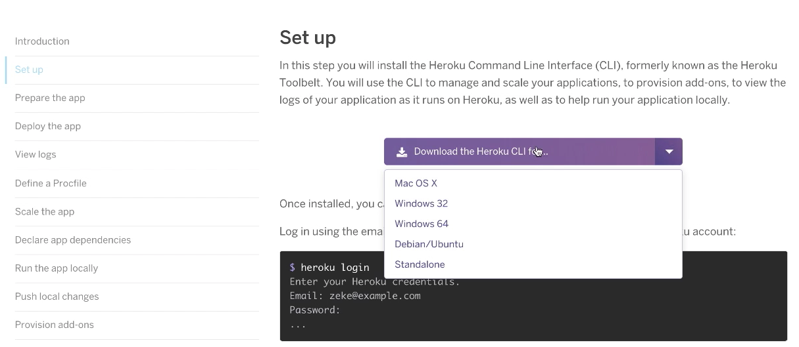

# React MySQL Deployment on Heroku

1. Go to [heroku.com](https://www.heroku.com/)
    - Sign Up
        - Fill out the form
        - Sign up for the free account
        - Proceed with E-mail verification
2. Log In to [heroku.com](https://www.heroku.com/)
3. Download `heroku cli` at [Heroku Dev Center](https://devcenter.heroku.com/start)

    - Select Node JS
      
    - Click on large purple button **I'm ready to start**
      

    * Click on large purple button **Download the Heroku CLI for...**
    * Select operating system from drop down
      

4. In the Terminal enter project directory
5. Type `heroku login` Enter credentials
   
6. Delete `.git` directory >>> `rm -rf .git`
7. Create a new git repository >>> `git init`
8. Create a `Procfile` >>> `touch Procfile`
    * On the first line of the `Procfile` write the command you'd like heroku to run with web as its key >>> e.g. **web:** `npm start`
    
9. Add and Commit your projects with `Procfile` to your local git repository >>> `git add . && git commit -m 'intial commit'`
10. In the terminal type `heroku create`
    * It will give you the url to your site and git repository
    
11. In terminal type `git push heroku master`
    * This will push to Heroku and send an environment variable `NODE_ENV = 'production'`
        * Typing `heroku open` in the terminal after completion will open the app for your to view (it will already be deployed {no database or environment variables})

## Setting Up Heroku
This will allow database to be used, give more hours for deployment, as well as other things

1. Log In to [Heroku](https://id.heroku.com/login)
2. Go to Account Settings

