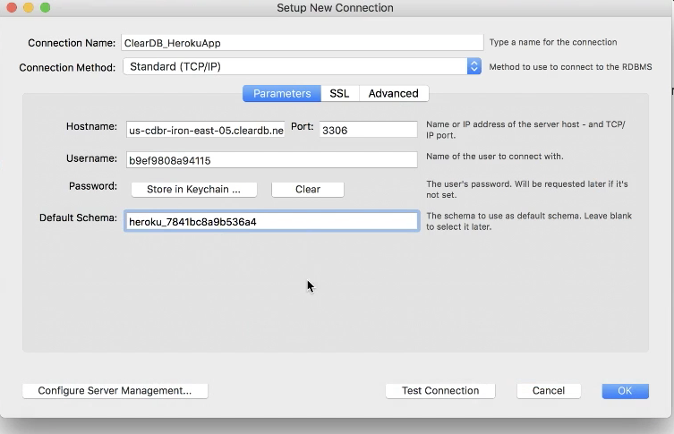
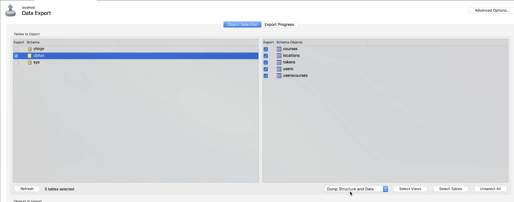

# React MySQL Deployment on Heroku

Walkthrough to launch a Full-Stack Javascript Application on Heroku

## Launching App (no environment variables / Database... yet)

1. Go to [heroku.com](https://www.heroku.com/)
    - Sign Up
        - Fill out the form
        - Sign up for the free account
        - Proceed with E-mail verification
2. Log In to [heroku.com](https://www.heroku.com/)
3. Download `heroku cli` at [Heroku Dev Center](https://devcenter.heroku.com/start)
    - Select Node JS
    - Click on large purple button **I'm ready to start**
        - Click on large purple button **Download the Heroku CLI for...**
    * Select operating system from drop down

4. In the Terminal enter project directory
5. Type `heroku login` Enter credentials

6. Delete `.git` directory >>> `rm -rf .git`
7. Create a new git repository >>> `git init`
8. Create a `Procfile` >>> `touch Procfile`
    - On the first line of the `Procfile` write the command you'd like heroku to run with web as its key >>> e.g. **web:** `npm start`

9. Add and Commit your projects with `Procfile` to your local git repository >>> `git add . && git commit -m 'intial commit'`
10. In the terminal type `heroku create`
    - It will give you the url to your site and git repository

11. In terminal type `git push heroku master`
    -   This will push to Heroku and send an environment variable `NODE_ENV = 'production'`
    -   Typing `heroku open` in the terminal after completion will open the app for your to view (it will already be deployed {no database or environment variables})

## Setting Up Heroku for Extra Features/Bonuses (Free)

This will give you 450 hours of dyno usage (time site is deployed), allow you to use Heroku elements (plugins [e.g. clearDB to upload database]), as well as other things

1. Log In to [Heroku](https://id.heroku.com/login)
2. Go to Account Settings

    

3. Go to Billing

4. Add Credit Card (it will not charge you anything unless you activate paid tiers)

## Setting Up Environment Variables and Database

1. Go to your Applications portion of Heroku [https://dashboard.heroku.com/apps](https://dashboard.heroku.com/apps)
2. Click on your application
3. Click on **Configure Add ons**
    - You should see your script to run production inside (what was in your `Procfile`) \*picture below in step 4

4. Search Add Ons for `cleardb`

5. Select **Ignite -- Free** (should already be selected)

6. Click **Provision** button
    - You will see ClearDB MySQL now added to your app
7. Click on **Settings** tab
8. Click on **Reveal Config Vars** button

9. Click on the Pencil icon to Edit
    - You will see a long string in the Value input box
    - Between `mysql://` and next colon `:` will be your database username
    - Between `:` and `@` will be the password
    - Between `@` and `/` will be the host
    - Between `/` and `?` will be the database name

#### Click Edit

#### Database Username

#### Database Password

#### Database Host

#### Database Name

10. At this time you can add your environment variables into the inputs

### Inside Your MySQL Workbench

This is to connect to the Heroku MySQL Database remotely

1. Add a New Connection

2. Enter in inputs (NO PASSWORD)
    - **Hostname** === Heroku database host
    - **Username** === Heroku database username
    - **Password** !!SKIP!!
    - **Default Schema** === Heroku database name

3. Go into localhost application (we are getting local database tables & values)
4. Click on Server >> Data Export

    

5. Under **Tables to Export** select databases to export
6. Select all tables to export
7. Make sure **Dump Structure and Data** is selected

    

8. Make sure **Objects to Export >> Dump Stored Procedures and Functions** is not checked \*_it will cause errors if checked_

    

9. Select directory and name the file under **Export Options >> Export to Self-Contained File**

    

10. Click **Start Export**
    - You will get a _mysqldump Version Mismatch_ warning but click "Continue Anyway"
    - You will now have a sql file which can be imported to the Heroku MySql database
11. Go out of your database and log into the Heroku Database (saving password to keychain)
12. Go to **Server >> Data Import**

    

13. Select Import from **Self-Contained File**
14. Find and Select your file to be imported

    

15. Under **Default Target Schema** Select your Heroku database name

    

16. Click **Start Import**
17. Exit tab and refresh database
    - Database tables and values should be inserted

### NOTE:
Anytime you want to make a change to your deployed app you

1. `git add .`
2. `git commit 'commit message'`
3. `git push heroku master`